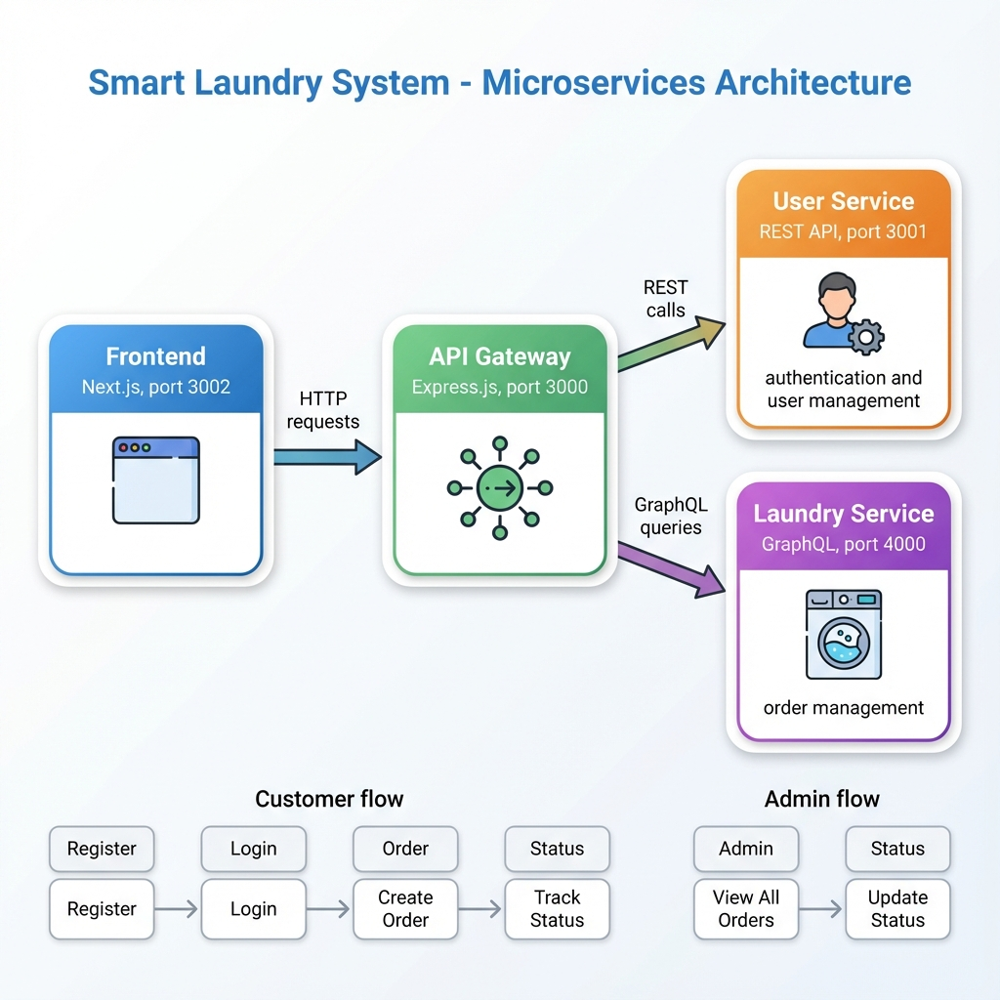

# 🚿 Smart Laundry System

Sistem manajemen laundry berbasis microservices yang memungkinkan pelanggan untuk membuat pesanan laundry dan admin untuk mengelola status pesanan.

## 📋 Deskripsi Project

Smart Laundry System adalah aplikasi web yang dibangun menggunakan arsitektur **microservices**. Sistem ini terdiri dari beberapa layanan yang saling terhubung:

| Service | Teknologi | Port | Fungsi |
|---------|-----------|------|--------|
| **API Gateway** | Express.js | 3000 | Pintu masuk utama, routing, dan verifikasi JWT |
| **User Service** | REST API | 3001 | Autentikasi (login/register) dan manajemen user |
| **Laundry Service** | GraphQL | 4000 | Manajemen pesanan laundry (CRUD) |
| **Frontend** | Next.js | 3002 | Antarmuka pengguna (UI) |

## 🏗️ Arsitektur

```
┌─────────────┐     ┌──────────────┐     ┌────────────────┐
│   Frontend  │────▶│  API Gateway │────▶│  User Service  │
│  (Next.js)  │     │   (Express)  │     │   (REST API)   │
└─────────────┘     └──────────────┘     └────────────────┘
                           │
                           ▼
                    ┌────────────────┐
                    │Laundry Service │
                    │   (GraphQL)    │
                    └────────────────┘
```



## ✨ Fitur Utama

### Untuk Customer:
- ✅ Registrasi dan Login
- ✅ Membuat pesanan laundry baru
- ✅ Melihat daftar pesanan sendiri
- ✅ Tracking status pesanan (Pending → Washing → Drying → Ready → Delivered)

### Untuk Admin:
- ✅ Melihat semua pesanan
- ✅ Update status pesanan
- ✅ Manajemen user

## 🚀 Cara Menjalankan

### Prasyarat
- Docker & Docker Compose terinstall
- Git (opsional)

### Langkah-langkah

1. **Clone atau buka folder project**
   ```bash
   cd "d:\Dokumen\SEMESTER 5\TUBES EAI\TUBES"
   ```

2. **Jalankan dengan Docker Compose**
   ```bash
   docker-compose up --build
   ```

3. **Akses aplikasi**
   - 🌐 **Frontend**: http://localhost:3002
   - 🔌 **API Gateway**: http://localhost:3000
   - 📊 **GraphQL Playground**: http://localhost:4000/graphql

## 👤 Akun Default

| Role | Email | Password |
|------|-------|----------|
| Admin | admin@laundry.com | admin123 |
| Customer | (Daftar baru) | - |

## 📁 Struktur Folder

```
TUBES/
├── api-gateway/          # API Gateway (Express.js)
│   ├── server.js
│   └── Dockerfile
├── services/
│   ├── user-service/     # User Service (REST API)
│   │   ├── routes/
│   │   ├── data/
│   │   └── server.js
│   └── laundry-service/  # Laundry Service (GraphQL)
│       └── server.js
├── frontend-app/         # Frontend (Next.js)
│   └── src/app/
├── keys/                 # JWT Keys (RSA)
├── docker-compose.yml
└── README.md
```

## 🔐 Keamanan

- **JWT (JSON Web Token)**: Autentikasi menggunakan RSA-256
- **Helmet**: Proteksi HTTP headers
- **CORS**: Cross-Origin Resource Sharing
- **Rate Limiting**: Pembatasan request per IP

## 🛠️ Teknologi yang Digunakan

- **Backend**: Node.js, Express.js, Apollo Server (GraphQL)
- **Frontend**: React, Next.js, Apollo Client
- **Database**: In-memory (untuk demo)
- **Containerization**: Docker, Docker Compose
- **Authentication**: JWT dengan RSA-256

## 📝 API Endpoints

### User Service (REST)
| Method | Endpoint | Deskripsi |
|--------|----------|-----------|
| POST | `/api/auth/register` | Registrasi user baru |
| POST | `/api/auth/login` | Login user |
| GET | `/api/auth/me` | Info user yang login |
| GET | `/api/users` | Daftar semua user |

### Laundry Service (GraphQL)
```graphql
# Query
myOrders: [Order]
allOrders: [Order]
order(id: ID!): Order

# Mutation
createOrder(input: CreateOrderInput!): Order
updateOrderStatus(id: ID!, status: OrderStatus!): Order
deleteOrder(id: ID!): Order
```

## 🎓 Dibuat Untuk

**Tugas Besar Enterprise Application Integration (EAI)**
Semester 5 - 2024/2025

---

*Sistem ini dikembangkan untuk keperluan pembelajaran dan demonstrasi arsitektur microservices.*
